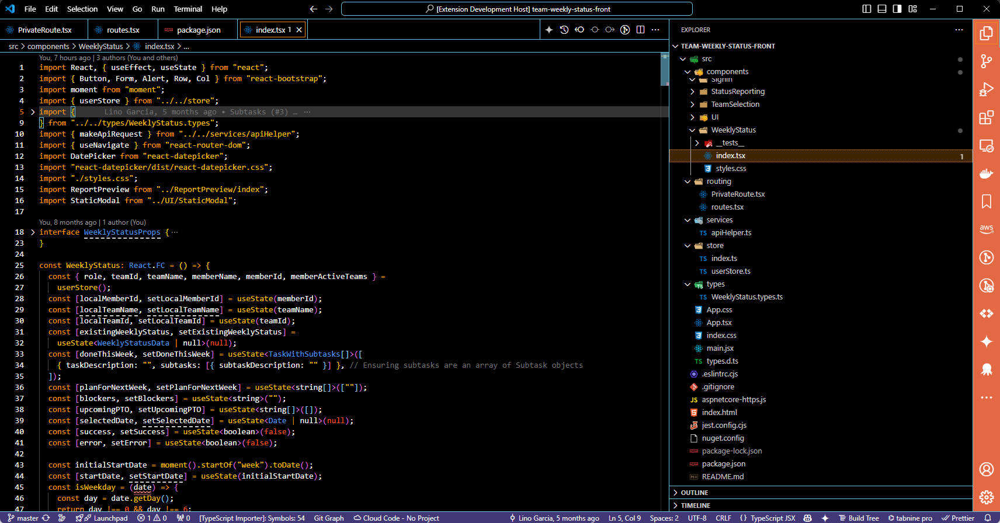
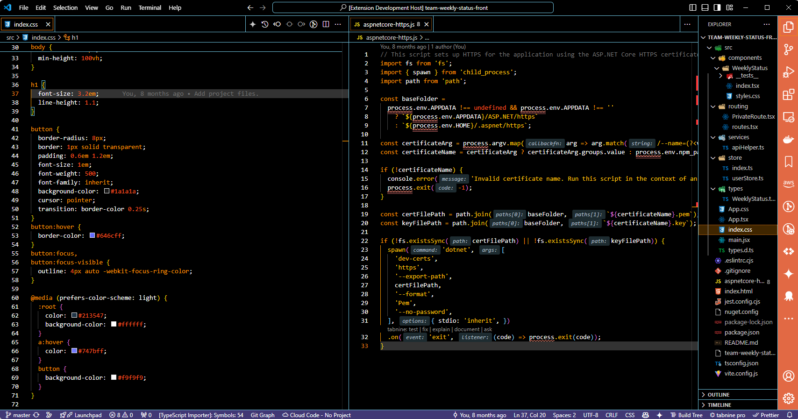
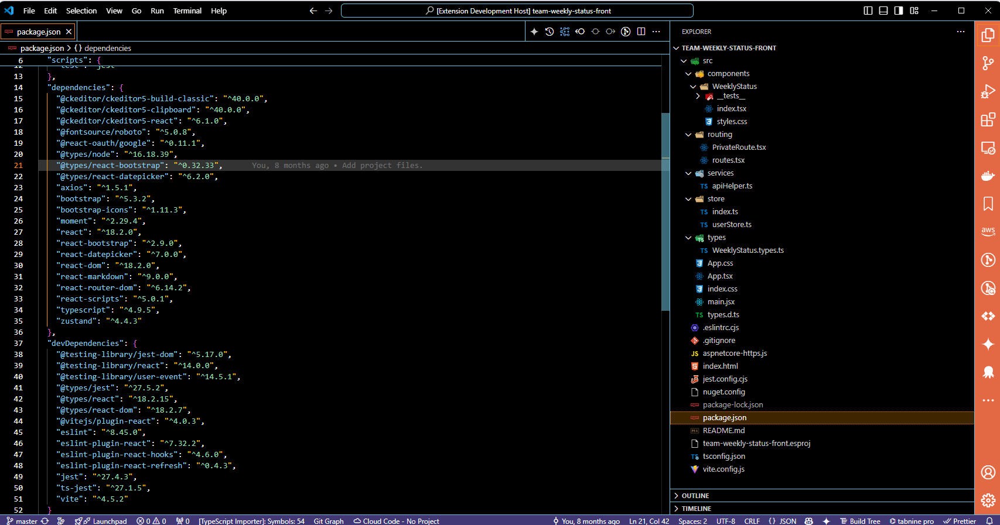

# MangoChango Dark (High Contrast) Theme

## Welcome to the MangoChango Dark Theme!

Dive into the vibrant and sleek world of web development with the MangoChango Dark Theme – meticulously crafted for the innovative minds at MangoChango and now available for the entire developer community!

This theme is not just another dark theme; it’s a celebration of the MangoChango spirit, designed to enhance your coding experience and boost productivity. Whether you're building stunning user interfaces with ReactJS, writing robust TypeScript code, styling with CSS, or creating dynamic components with JSX, the MangoChango Dark Theme has got you covered.

## Why Choose MangoChango Dark Theme?
* **Vibrant and Elegant Palette:** Experience a perfect balance of vibrant colors and deep contrasts that make your code pop while being easy on the eyes during long coding sessions.
* **Productivity-Boosting Design:** Thoughtfully designed to reduce eye strain and improve readability, allowing you to code longer and more efficiently.
* **Seamless Integration:** Whether you’re working on frontend or backend, the MangoChango Dark Theme integrates seamlessly with your favorite VS Code extensions and tools.

**Join the MangoChango Developer Community!**  
By adopting the MangoChango Dark Theme, you’re not just enhancing your coding environment; you’re becoming part of a thriving community of developers who share a passion for innovation and excellence. Let's build the future of web development together!

Install the MangoChango Dark Theme today and transform your coding experience with the vibrant spirit and colors of MangoChango!

## Samples

